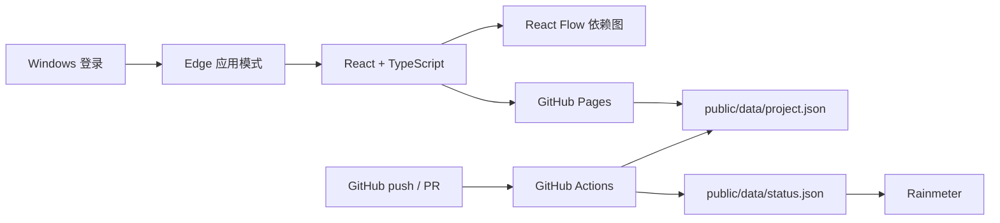

# 技术架构

## 结论

采用 GitHub-only 静态架构，不维护独立服务器。所有成员访问同一 Pages URL；GitHub Actions 把提交、推送和 PR 事件归集为仓库内的状态 JSON，网页和 Rainmeter 轮询读取。

## 技术栈

| 层 | 选择 | 理由 |
|---|---|---|
| 前端 | React 19 + TypeScript + Vite | 团队容易维护，迭代和部署成本低 |
| 依赖图 | React Flow | 支持缩放、平移、节点详情与大图导航 |
| 状态数据 | GitHub JSON + Pages | 不需要独立服务器；网页和 Rainmeter 轮询 |
| 审计 | PostgreSQL 追加事件表 + 证据表 | 贡献与状态变化可以追溯到节点和证据 |
| 权限 | GitHub repository permissions | 用 PR review 和 branch protection 控制写入 |
| 代码贡献 | GitHub Actions | 用 push、PR 和 Commit URL 作为证据来源 |
| 桌面 | PWA + Edge `--app` 启动 | 无需维护原生安装包即可开机显示、全屏投影 |
| 后续原生封装 | Tauri 2（可选） | 只有需要托盘、系统通知或离线文件访问时再加 |

## 数据边界

看板只保存任务元数据、实验摘要、哈希和证据链接。原始第一视角视频、受试者信息和工厂敏感数据留在现有受控存储中，避免为了看进度而复制敏感数据。

## 审计规则

1. 节点必须有负责人、硬依赖和可验证的验收标准。
2. 硬依赖未完成时，下游节点不会进入“当前可开工”。
3. 节点至少有一条通过审计的证据后才能标为“已验证”。
4. 团队贡献按通过审计的证据和完成节点展示，不按代码行、提交次数或在线时长排名。
5. Git Webhook 只创建贡献事件或候选证据，不自动判定实验成功。

## 生产部署

1. 在仓库 Settings → Pages 中把 Source 设置为 GitHub Actions。
2. 保护 `main` 分支，要求至少一名成员 review。
3. 推送代码，Actions 自动构建并部署 `dist/`。
4. 每台 Windows 电脑执行 `scripts/install-startup.ps1 -AppUrl "https://LimbusSpace.github.io/team-graph/"`。
5. Rainmeter 导入 `rainmeter/TeamGraph.ini`，按需修改 `FeedUrl`。

## Git 自动归集

提交信息、分支名或 PR 标题中写节点编号，例如 `RG-032: add drift detector`。GitHub Actions 会把提交进入节点的“待审计证据”，由团队成员通过修改 `public/data/project.json` 的 PR 确认后才计入项目进度。
