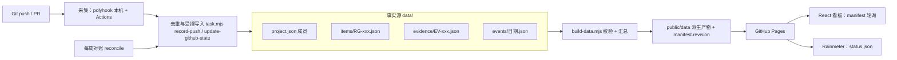

# 技术架构

## 结论

采用 GitHub-only 静态架构，不维护独立服务器。所有成员访问同一 Pages URL；
Git 事件经过受控入口写入 `data/` 事实源，构建脚本校验后生成发布产物，网页和 Rainmeter 轮询读取。



## 数据边界

- `data/` 是唯一事实源：任务、依赖、证据、活动、交接摘要各自独立成文件，
  一次任务操作只触碰自己那份；
- `public/data/` 是发布快照：前端完整视图 ≠ Agent 每次需要的上下文
  （Agent 用 `task context`，只读单任务所需内容）；
- 看板只保存任务元数据、实验摘要、哈希和证据链接。原始第一视角视频、
  受试者信息和工厂敏感数据留在现有受控存储中；
- 页面公开意味着数据公开：发布构建时就应该过滤不该公开的内容，
  不能靠前端隐藏；仓库私有不代表 Pages 私有。

## 状态规则（集中在 scripts/lib/rules.mjs）

1. 节点必须有负责人、硬依赖和可验证的验收标准。
2. 硬依赖未完成时，下游节点不会进入“当前可开工”，也不允许标记完成。
3. 节点至少有一条通过审计的证据后才能标为“已验证”，且必须记录审计人。
4. done 不是普通状态迁移：只能由审计确认进入；done 后的新提交只追加活动，
   不自动回退状态。
5. 不同任务类型的 Git 推进策略不同：

   | 类型 | push 触发开工 | PR 合并进入待审计 | 说明 |
   |---|---|---|---|
   | task / release | ✓ | ✓ | 常规代码任务 |
   | experiment | ✓ | ✗ 只生成证据 | 脚本合并不代表实验已执行 |
   | claim | ✓ | ✗ 只生成证据 | 论点代码合并不代表论点已验证 |
   | gate | ✓ | ✗ 只生成证据 | 决策门需要人工签字 |
   | mission | ✗ 锁定 | ✗ | 展示锚点，自动流程不触碰 |

6. 人工确认必须可追溯：证据通过时记录 `audit.reviewerId / reviewedAt / note /
   reviewRef`。身份与授权由受保护的 PR review 或认证过的工作流确认，
   JSON 里自填的名字只是记录，不构成授权。

## 事件归集：采集 → 去重 → 事实源 → 校验 → 构建 → 部署

```text
采集 Git 事件（polyhook 本机 push、GitHub Actions push/PR、每周对账）
    ↓
按业务身份去重：仓库 + commit SHA + 任务 ID + 事件类型（PR 用编号 + 动作）
    ↓
受控入口写入事实源（task.mjs record-push / update-github-state.mjs）
    ↓
统一校验整个任务图（task.mjs validate）
    ↓
生成 project.json + status.json + manifest.json + items 详情 + seed.ts
    ↓
构建并部署（gh-pages 只作为发布结果，不是业务事实源）
```

要点：

- **Hook 降噪**：`git add` 不进共享历史；`git commit` 本身就是可重放的本地记录，
  不立刻写共享图；`git push` 汇总本次推送的 commit（本地游标记录同步位置）；
  PR 打开、合并是明确的协作里程碑，单独记录。
- **跨来源去重**：Hook、Actions、对账可能观察到同一 Git 操作。
  事件与证据 ID 由业务身份哈希生成，重复上报静默幂等跳过；
  不用时间戳做唯一标识，否则重试会变成新事件。
- **Hook 不阻断**：polyhook 失败只写 stderr 日志，永远 approve，git 操作照常完成。
- **commit message 只提取任务编号**这一个结构化字段，不当作授权命令或可信指令。
- **concurrency 不是事件队列**：运行被取消就可能漏处理。漏掉的事件由
  每周对账重放最近的 commit 和已合并 PR 补偿（可重放 + 幂等更新），
  不依赖“每次运行恰好处理完当前事件”。
- **写冲突**：并发写入方可用 `--expect-revision` 做乐观校验，基准不一致直接拒绝，
  重新读取后再试；CI 的 `build-data.mjs --check` 保证提交进 main 的派生产物没有过期。
- **循环终止**：派生数据提交回 main 会再次触发 workflow，但 github-actions[bot]
  的 push 不参与归集，第二轮只负责部署，循环自然结束。

## 前端同步协议（静态轮询）

```text
轮询 manifest.json（很小）
    ↓ 比较 revision
未变化：结束
有变化：加载 project.json（整图）
点开任务：直接使用整图数据；Agent 可按需读 data/items/RG-xxx.json 详情
```

- 页面隐藏时暂停轮询，重新可见立即检查；
- 请求失败按 30s → 60s → 120s → 240s 退避；
- 只接受 revision 变化的响应，避免请求乱序回退；
- PWA 预缓存只含应用资源，`data/*.json` 不进 cache-first 缓存；
- 页面显示“最后同步时间”，明确这是轮询而非实时推送。

## 生产部署

1. 在仓库 Settings → Pages 中把 Source 设置为 `gh-pages` 分支根目录。
2. 保护 `main` 分支，要求至少一名成员 review。
3. 推送代码，Actions 自动归集、构建并部署 `dist/`。
4. 每台 Windows 电脑执行 `scripts/install-startup.ps1 -AppUrl "https://LimbusSpace.github.io/team-graph/"`。
5. Rainmeter 导入 `rainmeter/TeamGraph.ini`，按需修改 `FeedUrl`。

## Polyhook 跨 Agent Hook

共享脚本 `scripts/team-graph-polyhook.cjs` 使用 `@polyhook/sdk` 的 `read()`/`respond()`，
把 Claude Code、Cursor、Windsurf、Codex 的事件归一化后处理，只响应 `git push`。
每个 Agent 只安装自己的薄配置：`.codex/hooks.json`、`.claude/settings.json`、
`.cursor/hooks.json` 或 `.windsurf/hooks.json`。每台机器的 Team Graph 绝对路径写在
未跟踪的 `.team-graph/team-graph.local.json` 中；自动推送只有安装时显式传入
`-AutoPush` 才开启。归集动作经 `scripts/task.mjs record-push` 受控入口写入事实源。

## 未启用方案

Supabase（在线同步、账号体系）与 WebSocket 实时推送暂缓，相关代码隔离在
`experimental/supabase/`，不参与主线构建和文档。只有当出现“网页内直接修改任务、
细粒度权限、私有数据访问控制、多人高频并发编辑、秒级同步”这些明确需求时再启用；
届时需同步更新 `generate-seed-sql.ts` 以匹配新的快照 schema。
